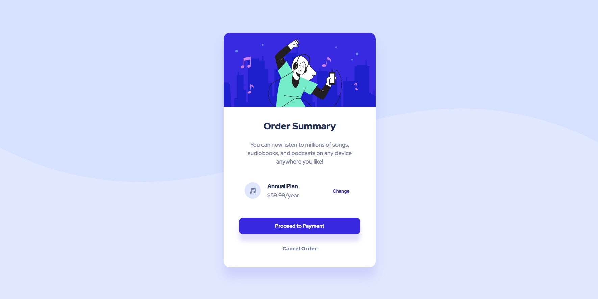
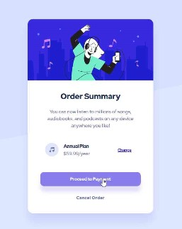
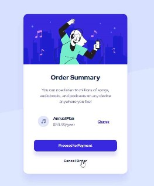

# Frontend Mentor - Order summary card solution

This is a solution to the [Order summary card challenge on Frontend Mentor](https://www.frontendmentor.io/challenges/order-summary-component-QlPmajDUj).

## Table of contents

- [Screenshot](#screenshot)
- [My process](#my-process)
  - [Built with](#built-with)
  - [What I learned](#what-i-learned)

## Screenshot

### Hover States

## My process

### Built with
- Semantic HTML5 markup
- CSS custom properties
- Flexbox
- Mobile-first workflow
- Media queries

### What I learned
- line-height can be a simpler property for styling an anchor tag to also auto-center the text vertically.
- Using an svg as a background image is a bit trickier than a regular image, but was able to set the background color to the body and position the main background image svg to the top to achieve the proper background layout.
- letter-spacing can be negative to achieve the desired formatting.
- Setting the illustration image width to 100% helps with responsiveness when the media query changes the card width.